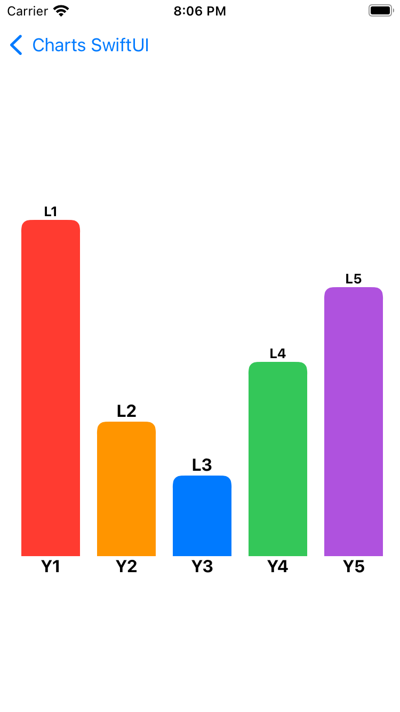
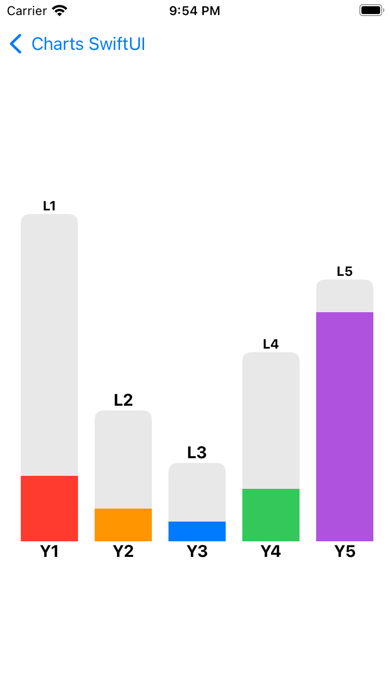

# ChartsSwiftUI

ChartsSwiftUI is a collection of several graphs built for iOS apps in SwiftUI.

## Types of Charts

## Vertical Bar Charts
ChartsSwiftUI supports rendering of basic vertical bar chart alongwith advanced customisations and interactions.

### Usage

| iPhone | iPad | WatchOS |
| --- | ---- | --- |
|  |  |  |

<b>Basic example:</b>
```
/// Loading Bar Entries
let loadingBars: [VerticalBarChartView.BarEntry] = [
    VerticalBarChartView.BarEntry(id: 0, xTopLabel: VerticalBarChartView.AttributedString(text: "--", color: .black, uiFont: .systemFont(ofSize: 16.0, weight: .bold)), yTopLabel: VerticalBarChartView.AttributedString(text: "Y1", color: .black, uiFont: .systemFont(ofSize: 16.0, weight: .bold)), backgroundValue: 5000.0, foregroundValue: 0.0, backgroundColor: .red, foregroundColor: .white, dashedBackgroundColor: .white, dashedForegroundColor: .gray),
    VerticalBarChartView.BarEntry(id: 0, xTopLabel: VerticalBarChartView.AttributedString(text: "--", color: .black, uiFont: .systemFont(ofSize: 16.0, weight: .bold)), yTopLabel: VerticalBarChartView.AttributedString(text: "Y2", color: .black, uiFont: .systemFont(ofSize: 16.0, weight: .bold)), backgroundValue: 2000.0, foregroundValue: 0.0, backgroundColor: .orange, foregroundColor: .white, dashedBackgroundColor: .white, dashedForegroundColor: .gray),
    VerticalBarChartView.BarEntry(id: 0, xTopLabel: VerticalBarChartView.AttributedString(text: "--", color: .black, uiFont: .systemFont(ofSize: 16.0, weight: .bold)), yTopLabel: VerticalBarChartView.AttributedString(text: "Y3", color: .black, uiFont: .systemFont(ofSize: 16.0, weight: .bold)), backgroundValue: 1200.0, foregroundValue: 0.0, backgroundColor: .blue, foregroundColor: .white, dashedBackgroundColor: .white, dashedForegroundColor: .gray),
    VerticalBarChartView.BarEntry(id: 0, xTopLabel: VerticalBarChartView.AttributedString(text: "--", color: .black, uiFont: .systemFont(ofSize: 16.0, weight: .bold)), yTopLabel: VerticalBarChartView.AttributedString(text: "Y4", color: .black, uiFont: .systemFont(ofSize: 16.0, weight: .bold)), backgroundValue: 2890.0, foregroundValue: 0.0, backgroundColor: .green, foregroundColor: .white, dashedBackgroundColor: .white, dashedForegroundColor: .gray),
    VerticalBarChartView.BarEntry(id: 0, xTopLabel: VerticalBarChartView.AttributedString(text: "--", color: .black, uiFont: .systemFont(ofSize: 16.0, weight: .bold)), yTopLabel: VerticalBarChartView.AttributedString(text: "Y5", color: .black, uiFont: .systemFont(ofSize: 16.0, weight: .bold)), backgroundValue: 4000.0, foregroundValue: 0.0, backgroundColor: .purple, foregroundColor: .white, dashedBackgroundColor: .white, dashedForegroundColor: .gray)
                    ]

/// Loaded Bar Entries
let loadedBars: [VerticalBarChartView.BarEntry] = [
    VerticalBarChartView.BarEntry(id: 0, xTopLabel: VerticalBarChartView.AttributedString(text: "L1", color: .black, uiFont: .systemFont(ofSize: 16.0, weight: .bold)), yTopLabel: VerticalBarChartView.AttributedString(text: "Y1", color: .black, uiFont: .systemFont(ofSize: 16.0, weight: .bold)), backgroundValue: 5000.0, foregroundValue: 0.0, backgroundColor: .red, foregroundColor: .white, dashedBackgroundColor: .white, dashedForegroundColor: .gray),
    VerticalBarChartView.BarEntry(id: 0, xTopLabel: VerticalBarChartView.AttributedString(text: "L2", color: .black, uiFont: .systemFont(ofSize: 16.0, weight: .bold)), yTopLabel: VerticalBarChartView.AttributedString(text: "Y2", color: .black, uiFont: .systemFont(ofSize: 16.0, weight: .bold)), backgroundValue: 2000.0, foregroundValue: 0.0, backgroundColor: .orange, foregroundColor: .white, dashedBackgroundColor: .white, dashedForegroundColor: .gray),
    VerticalBarChartView.BarEntry(id: 0, xTopLabel: VerticalBarChartView.AttributedString(text: "L3", color: .black, uiFont: .systemFont(ofSize: 16.0, weight: .bold)), yTopLabel: VerticalBarChartView.AttributedString(text: "Y3", color: .black, uiFont: .systemFont(ofSize: 16.0, weight: .bold)), backgroundValue: 1200.0, foregroundValue: 0.0, backgroundColor: .blue, foregroundColor: .white, dashedBackgroundColor: .white, dashedForegroundColor: .gray),
    VerticalBarChartView.BarEntry(id: 0, xTopLabel: VerticalBarChartView.AttributedString(text: "L4", color: .black, uiFont: .systemFont(ofSize: 16.0, weight: .bold)), yTopLabel: VerticalBarChartView.AttributedString(text: "Y4", color: .black, uiFont: .systemFont(ofSize: 16.0, weight: .bold)), backgroundValue: 2890.0, foregroundValue: 0.0, backgroundColor: .green, foregroundColor: .white, dashedBackgroundColor: .white, dashedForegroundColor: .gray),
    VerticalBarChartView.BarEntry(id: 0, xTopLabel: VerticalBarChartView.AttributedString(text: "L5", color: .black, uiFont: .systemFont(ofSize: 16.0, weight: .bold)), yTopLabel: VerticalBarChartView.AttributedString(text: "Y5", color: .black, uiFont: .systemFont(ofSize: 16.0, weight: .bold)), backgroundValue: 4000.0, foregroundValue: 0.0, backgroundColor: .purple, foregroundColor: .white, dashedBackgroundColor: .white, dashedForegroundColor: .gray)
]

/// Vertical bar chart - Loading state
let graphViewModel: VerticalBarChartViewModel = VerticalBarChartViewModel(dataLoaded: false, barEntries: loadingBars)

/// Vertical bar chart - Loaded state
graphViewModel.updateState(dataLoaded: true, barEntries: loadedBars)
```
<p align="center"></p>

### Features - Why this library is unqiue?

Here are some of the unique features provided by CHartsSwiftUI library:

- Multi platform support (iOS, iPad, WatchOS)
- Auto scaling of bars with respect to overall bar chart height
- Supports following customisations
  - Shimmer loading animation
  - Custom label supports on X and Y axis
  - Configurable bars background and foreground colors
  - Configurable axis display
- Advanced features
  - Supports tap gesture on individual bars.
  - Configurable seperator with markers across the graph

### Configurations

#### Configurable bar chart data state

Vertical bar chart supports 2 states:
- **Data Loading:** Display shimmer animation on the chart while the data is loading
- **Data Loaded:** Display data on the graph with the given styling 

#### Configurable bar chart style
Bar chart style can be configured by conforming to `VerticalBarChartStyleGuide`. The following items can be configured using vertical bar chart style guide:
1. **Bar Width:** The width of the bars in the chart.
2. **Chart height:** Overall height of bar chart.
3. **Spacing between labels:** Spacing between top/bottom X and Y axis labels
4. **Corner radius:** Corner radius of the bars
5. **Axis lines:** Show or hide gridline axis in the chart.

#### Configurable bar properties
The following properties can be configured individually for each of the bars inside vertical bar chart:
1. Font and Color of X and Y axis labels
2. Color of the bars, supports multiple colors in case of stacked bar charts.
3. Dashed line support to indicate overflows.
4. Solid or dashed line borders on the bars.

## More Examples

<b>Mock 1: Stacked Data Set</b>
```
let bars = [ 
    VerticalBarChartView.BarEntry(id: 0, xTopLabel: VerticalBarChartView.AttributedString(text: "L1", color: .black, uiFont: .systemFont(ofSize: 16.0, weight: .bold)), yBottomLabel: VerticalBarChartView.AttributedString(text: "Y1", color: .black, uiFont: .systemFont(ofSize: 16.0, weight: .bold)), backgroundValue: 5000.0, foregroundValue: 1000.0, backgroundColor: .gray.opacity(0.2), foregroundColor: .red, dashedBackgroundColor: .white, dashedForegroundColor: .gray), 
    VerticalBarChartView.BarEntry(id: 0, xTopLabel: VerticalBarChartView.AttributedString(text: "L2", color: .black, uiFont: .systemFont(ofSize: 16.0, weight: .bold)), yBottomLabel: VerticalBarChartView.AttributedString(text: "Y2", color: .black, uiFont: .systemFont(ofSize: 16.0, weight: .bold)), backgroundValue: 2000.0, foregroundValue: 500.0, backgroundColor: .gray.opacity(0.2), foregroundColor: .orange, dashedBackgroundColor: .white, dashedForegroundColor: .gray), 
    VerticalBarChartView.BarEntry(id: 0, xTopLabel: VerticalBarChartView.AttributedString(text: "L3", color: .black, uiFont: .systemFont(ofSize: 16.0, weight: .bold)), yBottomLabel: VerticalBarChartView.AttributedString(text: "Y3", color: .black, uiFont: .systemFont(ofSize: 16.0, weight: .bold)), backgroundValue: 1200.0, foregroundValue: 300.0, backgroundColor: .gray.opacity(0.2), foregroundColor: .blue, dashedBackgroundColor: .white, dashedForegroundColor: .gray), 
    VerticalBarChartView.BarEntry(id: 0, xTopLabel: VerticalBarChartView.AttributedString(text: "L4", color: .black, uiFont: .systemFont(ofSize: 16.0, weight: .bold)), yBottomLabel: VerticalBarChartView.AttributedString(text: "Y4", color: .black, uiFont: .systemFont(ofSize: 16.0, weight: .bold)), backgroundValue: 2890.0, foregroundValue: 800.0, backgroundColor: .gray.opacity(0.2), foregroundColor: .green, dashedBackgroundColor: .white, dashedForegroundColor: .gray), 
    VerticalBarChartView.BarEntry(id: 0, xTopLabel: VerticalBarChartView.AttributedString(text: "L5", color: .black, uiFont: .systemFont(ofSize: 16.0, weight: .bold)), yBottomLabel: VerticalBarChartView.AttributedString(text: "Y5", color: .black, uiFont: .systemFont(ofSize: 16.0, weight: .bold)), backgroundValue: 4000.0, foregroundValue: 3500.0, backgroundColor: .gray.opacity(0.2), foregroundColor: .purple, dashedBackgroundColor: .white, dashedForegroundColor: .gray)
]
```
<br/>
<p align="center"></p>

## Supported Platforms
ChartsSwiftUI is built using SwiftUI and includes supports for all platforms: iOS, iPad, WatchOS, etc.

## Getting Started / Contribution

Feature requests, bug reports, and pull requests are all welcome. Refer <a href="./.github/GETTING_STARTED.md">Getting Started Guide</a> and <a href="./.github/CONTRIBUTING.md">Contributing Guidelines</a> for more details.

## License
ChartsSwiftUI is available under the Apache 2.0 license. See the LICENSE file for more info.
